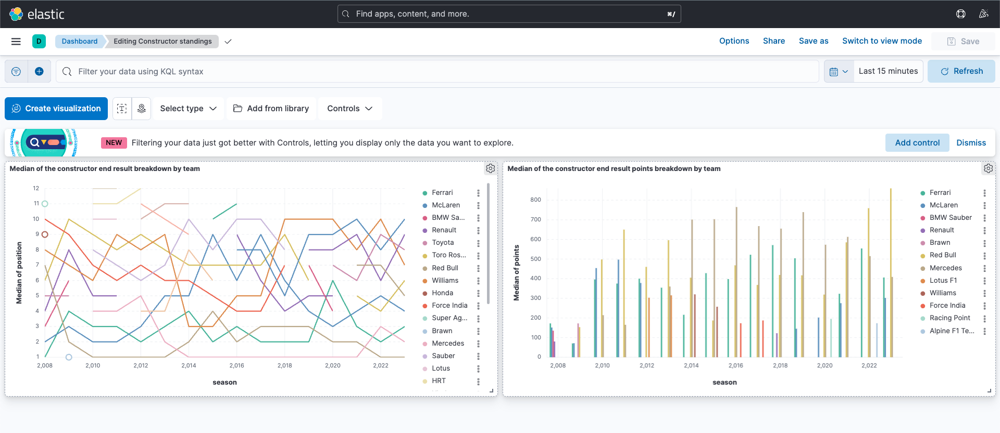

# F1 adatok elemzése - Dokumentáció
#### Vizsgált időszak 2008-2023

## Célok:
- időmérő helyezések összehasonlítása a verseny helyezésekkel
- előző éves győztes csapat helyezése a következő évben

### Adatszerzés:
- csapatok kinyerése
- pályák kinyerés
- versenyzők kinyerése
- időmérő helyezések kinyerése
- verseny helyezések kinyerése
- csapat pontok kinyerése

## Csapatok kinyerése
    
##### https://ergast.com/api/f1/{year}/constructors.json

#### Folyamat lépéseinek leírása:
- a vizsgált időszakhoz tartozó évek alapján lekérjük az összes csapatot
- a csapatokat egy listába tesszük, ahol kiszűrjük a duplikációkat

`cache/constructors.json` - a kinyert adatokat tartalmazza. [Kinyerést végző program itt található.](./scripts/extractConstructors.js)
## Pályák kinyerése 
##### https://ergast.com/api/f1/{year}/circuits.json

#### Folyamat lépéseinek leírása:

- a vizsgált időszakhoz tartozó évek alapján lekérjük az összes pályát
- a pályákat egy listába tesszük, ahol kiszűrjük a duplikációkat

`cache/circuits.json` - a kinyert adatokat tartalmazza. [Kinyerést végző program itt található.](./scripts/extractCircuits.js)

## Versenyzők kinyerése
##### https://ergast.com/api/f1/{year}/drivers.json
#### Folyamat lépéseinek leírása:

- a vizsgált időszakhoz tartozó évek alapján lekérjük az összes versenyzőt
- a versenyzőket egy listába tesszük, ahol kiszűrjük a duplikációkat

`cache/drivers.json` - a kinyert adatokat tartalmazza. [Kinyerést végző program itt található.](./scripts/extractDrivers.js)

## Időmérő helyezések kinyerése
##### https://ergast.com/api/f1/{year}/qualifying.json
#### Folyamat lépéseinek leírása:

A vizsgált időszakhoz tartozó évek alapján lekérjük az összes időmérő helyezést 
majd kapott struktúrát transzformálni kell a következő formára:

```json
    [
        {
            "season": 2008,
            "circuitName": "Albert Park Grand Prix Circuit",
            "circuitId": "albert_park",
            "driverId": "hamilton",
            "driverFullName": "Lewis Hamilton",
            "position": 1
        }
    ]
```

`cache/qualifyingResults.json` - a kinyert adatokat tartalmazza. [Kinyerést végző program itt található.](./scripts/extractQualifyingResults.js)

## Verseny helyezések kinyerése
##### https://ergast.com/api/f1/{year}/results.json

#### Folyamat lépéseinek leírása:
A vizsgált időszakhoz tartozó évek alapján lekérjük az összes verseny helyezést, majd a kapott struktúrát transzformálni kell a következő formára:
```json
[
    {
        "season": 2008,
        "circuitName": "Albert Park Grand Prix Circuit",
        "circuitId": "albert_park",
        "driverId": "hamilton",
        "driverFullName": "Lewis Hamilton",
        "position": 1
    }
   
]
```

`cache/raceResults.json` - a kinyert adatokat tartalmazza. [Kinyerést végző program itt található.](./scripts/extractRaceResults.js)
            
## Csapat pontok és helyezések kinyerése
##### https://ergast.com/api/f1/{year}/constructorStandings.json
#### Folyamat lépéseinek leírása:

A vizsgált időszakhoz tartozó évek alapján lekérjük az összes csapat pontot, majd kapott struktúrát transzformálni kell a következő formára:
```json           
 [
    {
        "season": 2008,
        "constructorId": "mclaren",
        "constructorName": "McLaren",
        "points": 151,
        "position": 2
    }
]
```

`cache/constructorStandings.json` - a kinyert adatokat tartalmazza. [Kinyerést végző program itt található.](./scripts/extractConstructorStandings.js)

## Adatok mentése Elasticsearch-be
`createIndex.js`
#### Folyamat lépéseinek leírása:
A meglévő adatokat egy Elasticsearch adatbázisba mentjük, ahol a következő indexeket hozzuk létre:
- qualifying_results
- race_results
- constructor_standings
#### Mapping:
`qualifying_results`:
```json
{
    "season": { "type": "integer" },
    "circuitName": { "type": "keyword" },
    "circuitId": { "type": "keyword" },
    "driverId": { "type": "keyword" },
    "driverFullName": { "type": "keyword" },
    "position": { "type": "integer" }
}
```
`race_results`:
```json
{
    "season": { "type": "integer" },
    "circuitName": { "type": "keyword" },
    "circuitId": { "type": "keyword" },
    "driverId": { "type": "keyword" },
    "driverFullName": { "type": "keyword" },
    "position": { "type": "integer" }
}
```
`constructor_standings`:
```json
{
    "season": { "type": "integer" },
    "constructorId": { "type": "keyword" },
    "constructorName": { "type": "keyword" },
    "position": { "type": "integer" },
    "points": { "type": "long" }
}
```


## Adatok megjelenítése Kibanában
Az adatok megjelnítéséhez a Kibana-t használtam, ahol a következő dashboardokat hoztam létre:
### Consturctor standings

-   Az első diagramon pedig a csapatok helyezése az évek függvényében.
-   A második diagramon pedig a csapatok pontszáma az évek függvényében.
### Position analysis

A helyezés elemzéséhez készített diagramokon pedig látható, hogy az időmérő helyezések és a verseny helyezések között milyen kapcsolat van.
- Az első diagramon a verseny illetve az időmérő helyezések száma látható helyezés és versenyző függvényében egy
hőtérképen a vizsált időszak egészére nézve.
- A második esetben ugyanez a diagram látható, csupán csak a verseny eredmények
láthatóak.
- Hasonlóan a harmadik esetben csak a verseny eredmények láthatóak.
- A negyedik illetve az ötödik diagramon pedig a verseny illetve az időmérő helyezések mediánjának alakulása olvasható le az évek függvényében.
- A hatodik diagramon pedig
a verseny illetve az időmérők helyezésének mediánja látható az egész időszakra nézve versenyzőkre lebontva. 
Ebből látható, hogy ez a kettő szám nem tér el egymástól.
- A hetedik illetve nyolcadik diagramon pedig pályára lebontva tekinthetőek meg a verseny illetve az időmérő helyezések mediánjai.
- Az utolsó diagramon pedig a verseny illetve az időmérő helyezések mediánjai láthatóak pályákra lebontva. Bár kissé zsúfolt
a diagram, sok adatot le lehet olvasni róla a dinamikusságank köszönhetően.

### Fejlesztő környezet
A feladat megoldásához a következő technológiákat használtam:
- `Node.js v17.9.0` - a programozási környezet a szkriptek futtatásához
- `Docker v20.0.6` - a program futtatásához (elasticsearch, kibana)
- `Elasticsearch v8.6.2` - az adatok tárolásához
- `Kibana v8.6.2` - az adatok megjelenítéséhez

További csomagok amiket használtam:
- `axios` - http kérések küldéséhez
- `eslint` - kód konvenciók betartásához
- `prettier` - kód formázáshoz
- `elasticsearch` - elasticsearch kliens

### Tapasztalatok leírása
Az eredményeket tekintve levonható az a következtetés, hogy általánosan az időmérő helyezés és a verseny helyezés között
van egy erős korreláció. Továbbá pedig látható, hogy a verseny illetve az időmérő helyezések mediánja nem tér el
nagyban egymástól. A konstruktorok helyezése alapján pedig látható, hogy az előző évek eredménye nem befolyásolja a következő
év eredményét egyértelműen. 

### Továbbfejlesztési lehetőségek
A program számos helyen egyszerűen bővíthető. A szkriptek adott helyen való módosításával könnyen meg lehet változtatni 
a struktúrát valmamint a kinyert adatokat. Az index létrehozásához használt mapping is könnyen módosítható, így a kinyert
adatokat könnyen lehet megjeleníteni Kibanában. A programot könnyen lehetne bővíteni újabb adatokkal. Ehhez csak az index
letrehozásához használt szkriptet szükséges futtatni miután a szüséges adatokat kinyertük.

## Összegezés
A feladat megoldásához szükséges adatokat sikeresen kinyertem, majd ezeket transzformálás után Elasticsearch adatbázisba
vagy adattárházba mentettem. Így munkám során általános ETL folyamatokat készítettem. A követelményeknek megfelelően az
összes szükséges adatot kinyertem, melyeket cache-elés szemponjátból el is mentettem. Az elemzéshez szükséges adatokat
sikeresen feltöltöttem Elasticsearch-be, és megjelenítettem Kibana segítségével. Készítettem dashboardokat, melyekről leolvashatóak
azon összefüggések melyek a specifikációban leírt céloknak megfelelnek. Feladatomban a hangsúlyt a technológiák használatára
fektettem mintsem a vizsgált adatok elemzésére. A programot úgy készítettem el, hogy könnyen bővíthető legyen, így a későbbiekben
egyszerűen lehet újabb adatokat kinyerni és megjeleníteni. Használtam kódolási konvenciókat, valamint sok kommentet írtam, hogy 
a program egyszerűen érthető legyen. 